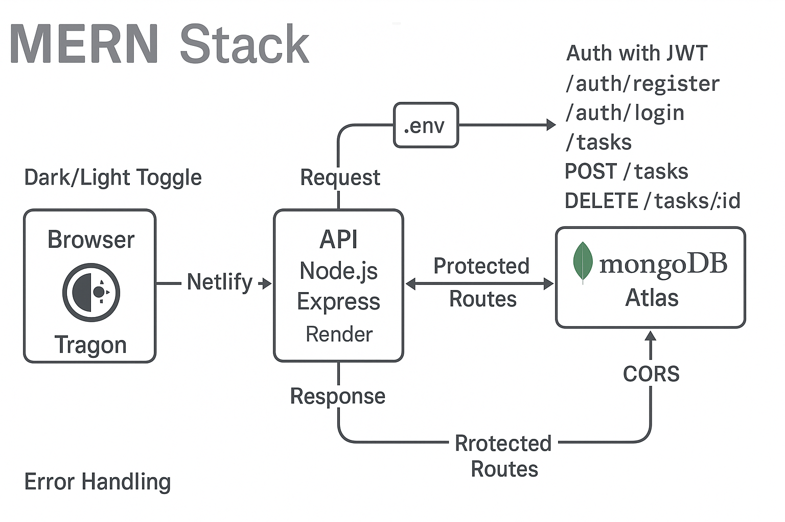

# Calvin Chang — Portfolio & Projects

Hi! I'm **Calvin Chang**, a UCSD CS grad building clean, practical web apps. This README highlights my featured work and how to try it locally.

> 🔭 **Featured Project:** A full‑stack **Task Manager (MERN)** with JWT auth, protected routes, and a modern React UI (dark/light).

---

## 🚀 Featured: Task Manager (MERN)

**Live Frontend:** https://task-manager-calchang1994.netlify.app  
**API Base URL:** https://task-manager-api-g0uk.onrender.com



### What it does
- Register/Login with **JWT** (hashed passwords with bcrypt)
- **Create / Read / Update / Delete** personal tasks
- Mark complete/incomplete
- **Protected routes** on both client and server
- **Dark/Light mode** toggle (persisted with localStorage)
- Deployed on **Netlify** (frontend) + **Render** (backend) + **MongoDB Atlas**

### Tech
- **Frontend:** React + Vite, fetch API, localStorage
- **Backend:** Node.js, Express, JWT, bcrypt, CORS
- **DB:** MongoDB Atlas

### REST API
**Auth**
- `POST /auth/register` — create user
- `POST /auth/login` — returns JWT

**Tasks** *(requires `Authorization: Bearer <token>`)*
- `GET /tasks` — list tasks
- `POST /tasks` — create task (`{ "title": "string", "completed": false }`)
- `PUT /tasks/:id` — update task
- `DELETE /tasks/:id` — delete task

### Quickstart (Local Dev)
```bash
# Backend
cd backend
npm install
cp .env.example .env    # set MONGO_URI, JWT_SECRET, CORS_ORIGIN
npm run dev

# Frontend
cd ../frontend
npm install
npm run dev
```

**.env example**
```bash
PORT=8080
MONGO_URI=mongodb+srv://<user>:<password>@<cluster-url>/<dbname>?retryWrites=true&w=majority
JWT_SECRET=replace_me
CORS_ORIGIN=http://localhost:5173
```

**cURL smokes**
```bash
# Register
curl -X POST https://task-manager-api-g0uk.onrender.com/auth/register   -H "Content-Type: application/json"   -d '{"username":"demo","password":"demo123"}'

# Login (copy JWT)
curl -X POST https://task-manager-api-g0uk.onrender.com/auth/login   -H "Content-Type: application/json"   -d '{"username":"demo","password":"demo123"}'

# Get tasks
curl -X GET https://task-manager-api-g0uk.onrender.com/tasks   -H "Authorization: Bearer {TOKEN}"
```

> **Troubleshooting**
> - **401**: Missing/expired JWT → send `Authorization: Bearer <token>`  
> - **500**: Check `MONGO_URI`/DB user perms  
> - **CORS**: Set `CORS_ORIGIN` to your Netlify URL  
> - **Bad hostname**: Always include full `https://`

---

## 🌐 Other Project(s)

- **Portfolio Website** — Personal site with project cards, live demo links, and GitHub repos.  
  _Demo:_ *(add link)* • _Repo:_ *(add link)*

> Want details or screenshots here? I can add a gallery section and update links.

---

## 🛠️ Skills
**Languages:** JavaScript/TypeScript, HTML, CSS  
**Frontend:** React, Vite  
**Backend:** Node.js, Express, REST, JWT  
**Database:** MongoDB (Atlas)  
**Tools:** Git/GitHub, Netlify, Render

---

## 📬 Contact
- GitHub: **@calchang1994**  
- LinkedIn: *(add link)*  
- Email: *(add email)*

---

*Last updated: 2025-09-13*
