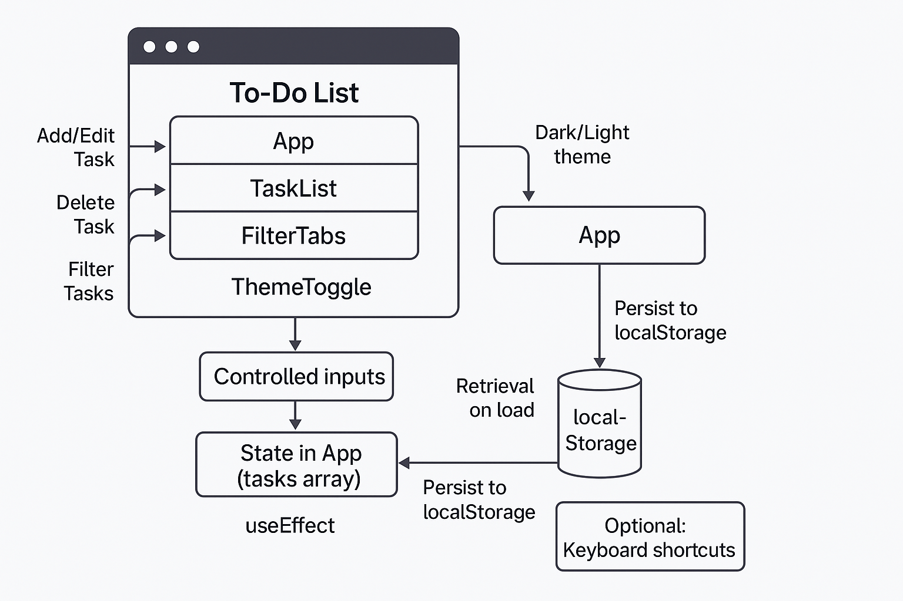

# Calvin Chang — Featured Projects

This README highlights two apps you can try right away:

1. **Task Manager (MERN)** — full‑stack with auth, protected routes, and MongoDB  
2. **To‑Do List (React)** — lightweight, client‑only app with localStorage

> If this is your main profile or portfolio repo, keep this file at the **repo root** as `README.md`.

---

## 🔗 Quick Links
- **Task Manager (Frontend):** https://task-manager-calchang1994.netlify.app  
- **Task Manager API Base:** https://task-manager-api-g0uk.onrender.com  
- **To‑Do List Demo:** https://calchang1994-port.github.io/todo-app/
- **Portfolio Site:** https://calchang1994.github.io/

---


## ✅ Project 1 — To‑Do List (React Only)



**Stack:** React + Vite (client‑side only) • localStorage persistence

### Features
- Add / edit / delete simple tasks
- Mark complete / incomplete
- **Filters:** All • Active • Completed
- **Dark/Light mode** toggle (persisted in localStorage)
- No backend required; everything runs in the browser

### Live Demo & Repo
- **Demo:** *(add Netlify or GitHub Pages link)*  
- **Repo:** *(add repo link)*

### Local Dev
```bash
# To‑Do (client only)
cd todo-react
npm install
npm run dev
```

### State Shape (example)
```js
// localStorage key: "todo-items"
[
  { "id": "a1", "title": "Buy milk", "completed": false },
  { "id": "a2", "title": "Ship package", "completed": true }
]
```

> **Nice extras to add**: keyboard shortcuts (Enter to add, Esc to cancel), drag‑and‑drop ordering, toast notifications.

---

## 📁 Suggested Repo Layout (mono‑repo example)
```
/                     # main repo root
├─ README.md          # this file
├─ architecture.png   # used by Task Manager section
├─ apps/
│  ├─ task-manager/   # MERN app (frontend + backend subfolders)
│  └─ todo-react/     # lightweight React-only To‑Do
└─ docs/
   └─ task-manager-readme.pdf
```

---

## 🚀 Project 2 — Task Manager (MERN)


**Stack:** React + Vite • Node.js + Express • MongoDB Atlas • JWT • Netlify • Render

### Features
- Register / Login with **JWT** (bcrypt‑hashed passwords)
- **CRUD** tasks tied to the authenticated user
- Mark complete / incomplete
- **Protected routes** (client & server)
- **Dark/Light mode** (persisted with localStorage)
- Deployed on **Netlify** (frontend) and **Render** (API)

### REST API
**Auth**
- `POST /auth/register` — create user
- `POST /auth/login` — returns JWT

**Tasks** *(requires `Authorization: Bearer <token>`)*
- `GET /tasks` — list tasks
- `POST /tasks` — create (`{ "title": "string", "completed": false }`)
- `PUT /tasks/:id` — update
- `DELETE /tasks/:id` — delete

### cURL smokes
```bash
# Register
curl -X POST https://task-manager-api-g0uk.onrender.com/auth/register   -H "Content-Type: application/json"   -d '{{"username":"demo","password":"demo123"}}'

# Login (copy JWT from response)
curl -X POST https://task-manager-api-g0uk.onrender.com/auth/login   -H "Content-Type: application/json"   -d '{{"username":"demo","password":"demo123"}}'

# Get tasks
curl -X GET https://task-manager-api-g0uk.onrender.com/tasks   -H "Authorization: Bearer {{TOKEN}}"
```

### Local Dev
```bash
# Backend
cd backend
npm install
cp .env.example .env    # set MONGO_URI, JWT_SECRET, CORS_ORIGIN
npm run dev

# Frontend
cd ../frontend
npm install
npm run dev
```

**.env example**
```bash
PORT=8080
MONGO_URI=mongodb+srv://<user>:<password>@<cluster-url>/<dbname>?retryWrites=true&w=majority
JWT_SECRET=replace_me
CORS_ORIGIN=http://localhost:5173
```

> **Troubleshooting**
> - **401**: send `Authorization: Bearer <token>`  
> - **500**: verify `MONGO_URI` and DB user permissions  
> - **CORS**: set `CORS_ORIGIN` to your Netlify URL  
> - **Bad hostname**: always include full `https:a//`

---

## 🧰 Skills
JavaScript/TypeScript • React • Node.js • Express • REST • JWT • MongoDB • Git/GitHub • Netlify • Render

## 📬 Contact
GitHub: **@calchang1994** • LinkedIn: *(add link)* • Email: *(add email)*

---

*Last updated: 2025-09-13*
